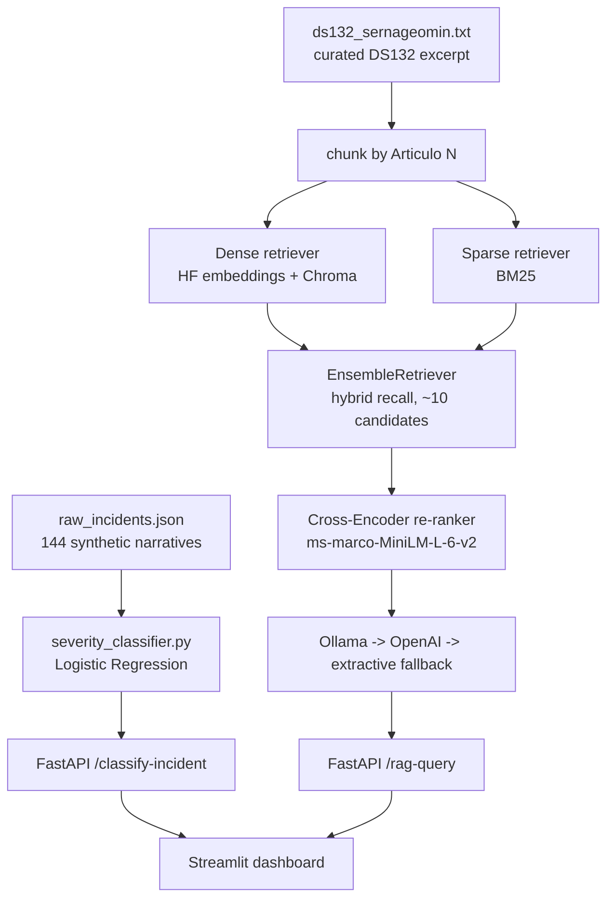

<div align="center">

# ⛑️ RAG Seguridad Minera Chile

**NLP + RAG system for incident classification and regulatory Q&A on Chilean mining safety law (DS 132)**

🌐 **[English](README.md)** | **[Español](README.es.md)**

[](https://www.python.org/)
[](https://python.langchain.com/)
[](https://www.trychroma.com/)
[](https://www.sbert.net/docs/pretrained-models/ce-msmarco.html)
[](https://fastapi.tiangolo.com/)
[](https://streamlit.io/)
[](02_Reranker_CrossEncoder_Evaluation.ipynb)
[](tests/)
[](LICENSE)

</div>

---

## 1. Business problem

Risk-prevention teams at Chilean mining operations write dozens of narrative incident reports every week (near-misses, equipment entrapments, rockfalls, blasting incidents, vehicle collisions). Two tasks currently done by hand, manually, are:

1. **Triage severity** of each narrative report (LEVE / GRAVE / FATAL) to prioritize investigation and legal reporting deadlines.
2. **Look up applicable regulation** in the *Reglamento de Seguridad Minera* (Supreme Decree 132, SERNAGEOMIN) — immediate-action protocols, required control measures, and the sanctions that apply — a ~150-page legal text that is slow to search manually under time pressure.

This project automates both: a text classifier trained on incident narratives predicts severity, and a Retrieval-Augmented Generation (RAG) assistant answers natural-language questions against the regulation, citing the exact article(s) it draws from.

> ⚠️ **Not a substitute for legal/compliance review.** See [§8 Regulatory disclaimer](#8-regulatory-disclaimer).

## 1.1 Business Impact & Key Performance Indicators

| Metric | Result | What it means |
|---|---|---|
| Severity classifier accuracy / F1-macro | 0.750 / 0.719 | Triages LEVE/GRAVE/FATAL incident narratives automatically |
| Retrieval quality, MRR before/after re-ranking | 0.920 → **0.981** | Cross-Encoder re-ranking pushes the truly relevant article higher in the results, not just present somewhere in top-4 |
| Retrieval quality, NDCG@4 before/after re-ranking | 0.940 → **0.986** | Rank-quality improvement, measured against a 27-query hand-labeled eval set |
| Citation Faithfulness (extractive mode) | 0.985 | Purpose-built metric avoiding an LLM-judge, since the whole pipeline works 100% without an external LLM |
| Verified retrieval examples | Article 247 for "pértiga", articles 157-162 for "fortificación/acuñadura" | Concrete, checkable retrieval correctness, not just aggregate metrics |
| Test suite | 34/34 passing | Includes eval-set-integrity checks (every ground-truth article covered by at least one query) |

## 2. Architecture



```
                         ┌───────────────────────────┐
                         │   data/raw_incidents.json  │  144 synthetic incident
                         │  (synthetic, DS132-linked) │  narratives (Chilean
                         └──────────────┬─────────────┘  mining jargon)
                                        │
                          embed (multilingual Sentence-Transformers)
                                        │
                                        ▼
                     ┌─────────────────────────────────────┐
                     │  Logistic Regression severity model  │  LEVE / GRAVE / FATAL
                     │  src/nlp/severity_classifier.py      │
                     └──────────────────┬────────────────────┘
                                        │
    ┌───────────────────────────────────┼───────────────────────────────────┐
    │                                    ▼                                   │
    │                       FastAPI  /classify-incident                     │
    │                                                                        │
    │   data/ds132_sernageomin.txt  ──►  chunk by "Artículo N"  ──►         │
    │   (curated DS132 excerpt)          (src/rag/pipeline.py)              │
    │                                          │                             │
    │                     ┌────────────────────┴────────────────────┐       │
    │                     ▼                                         ▼       │
    │            dense retriever                            sparse retriever│
    │      (HuggingFace embeddings + Chroma)                 (BM25 keyword) │
    │                     └────────────────────┬────────────────────┘       │
    │                          EnsembleRetriever (hybrid, stage 1: recall)   │
    │                                          │  ~10 candidates              │
    │                                          ▼                             │
    │                 Cross-Encoder re-ranker (stage 2: precision)           │
    │            cross-encoder/ms-marco-MiniLM-L-6-v2, src/rag/reranker.py   │
    │                                          │  top-k final                │
    │                     Ollama → OpenAI → extractive fallback              │
    │                              (pluggable synthesis backend)             │
    │                                          │                             │
    │                       FastAPI  /rag-query                             │
    └────────────────────────────────────────────────────────────────────────┘
                                        │
                          ┌─────────────┴─────────────┐
                          │   Streamlit dashboard      │
                          │  classify → auto RAG query │
                          └─────────────────────────────┘
```

**Design decisions worth calling out:**

- **Structure-aware chunking**: the regulation is split by its own `Artículo N` headers instead of naive character-count splitting, so a chunk is never a half-sentence from two different articles — critical for a legal domain where citation precision matters.
- **Hybrid retrieval**: a dense retriever (semantic similarity via multilingual embeddings) is combined with a sparse BM25 retriever (exact keyword matches) via `EnsembleRetriever`. Dense retrieval alone can miss exact article numbers or narrow technical terms (*"acuñadura"*, *"pértiga"*) that BM25 catches reliably.
- **Two-stage retrieval: hybrid recall + Cross-Encoder precision**: the hybrid retriever is tuned for recall — bring back a wide-enough candidate pool (10 by default) fast, over the whole collection. A Cross-Encoder (`cross-encoder/ms-marco-MiniLM-L-6-v2`) then re-scores those candidates by evaluating the question and each passage *together* in one forward pass (strictly more accurate than comparing two independently-computed embeddings, but too expensive to run over the full collection) — only the top-k after re-ranking reach the LLM. §7 has the measured MRR/NDCG improvement this gave, and `02_Reranker_CrossEncoder_Evaluation.ipynb` has the full comparison.
- **Pluggable, always-functional LLM backend**: the pipeline tries Ollama (local model) first, then OpenAI (if `OPENAI_API_KEY` is set), and falls back to an **extractive** mode (no LLM at all — just the ranked, cited article excerpts) if neither is available. This means the system is 100% testable and demoable with zero external dependencies or API keys.

## 3. Tech stack

| Layer | Choice |
|---|---|
| Language | Python 3.11+ (tested on 3.10.11 as well) |
| RAG framework | LangChain 1.x (`langchain-classic`, `langchain-community`, `langchain-chroma`, `langchain-huggingface`) |
| Vector store | ChromaDB (local, persisted to disk) |
| Embeddings | `sentence-transformers/paraphrase-multilingual-MiniLM-L12-v2` (Spanish-capable) |
| Sparse retrieval | BM25 (`rank-bm25`) |
| Re-ranking | Cross-Encoder `cross-encoder/ms-marco-MiniLM-L-6-v2` (`sentence-transformers`) |
| Classifier | Logistic Regression (scikit-learn) on sentence embeddings |
| LLM synthesis | Ollama (local) → OpenAI API → extractive fallback |
| API | FastAPI + Uvicorn |
| UI | Streamlit |
| Evaluation | MRR, NDCG@k, Context Relevance@k, Citation Faithfulness (`src/rag/evaluation.py`) |
| Tests | pytest |

## 4. Project structure

```
rag-seguridad-minera-chile/
├── data/
│   ├── raw_incidents.json          # 144 synthetic incident narratives
│   ├── ds132_sernageomin.txt       # Curated excerpt of DS 132 (real text)
│   ├── chroma_db/                  # Vector store (generated, gitignored)
│   └── models/                     # Trained classifier (generated, gitignored)
├── src/
│   ├── nlp/
│   │   ├── dataset_generator.py    # Synthetic incident dataset generator
│   │   └── severity_classifier.py  # Embedding + LogisticRegression classifier
│   ├── rag/
│   │   ├── pipeline.py             # Chunking, hybrid retriever, LLM backends
│   │   ├── reranker.py             # Cross-Encoder re-ranking (stage 2)
│   │   └── evaluation.py           # 27-query eval set + MRR/NDCG/faithfulness metrics
│   ├── api/
│   │   └── main.py                 # FastAPI: /classify-incident, /rag-query
│   └── app/
│       └── streamlit_app.py        # Interactive dashboard
├── 02_Reranker_CrossEncoder_Evaluation.ipynb   # executed, real outputs
├── tests/
│   ├── test_dataset_generator.py
│   ├── test_rag_pipeline.py
│   ├── test_reranker.py
│   ├── test_evaluation.py
│   └── test_severity_classifier.py
├── requirements.txt
├── pytest.ini
├── .gitignore
├── README.md
└── README.es.md
```

## 5. Setup

```powershell
git clone https://github.com/Rxyxs/rag-seguridad-minera-chile.git
cd rag-seguridad-minera-chile

python -m venv .venv
.venv\Scripts\activate        # Windows
# source .venv/bin/activate   # macOS/Linux

pip install -r requirements.txt
```

## 6. Usage

**1. Generate the synthetic incident dataset**

```powershell
python -m src.nlp.dataset_generator
```
Writes `data/raw_incidents.json` (144 incidents across 12 incident types, seeded/deterministic).

**2. Train the severity classifier**

```powershell
python -m src.nlp.severity_classifier
```
Trains on sentence embeddings, evaluates on a held-out split, saves `data/models/severity_classifier.joblib`.

**3. Run the RAG pipeline (CLI demo)**

```powershell
python -m src.rag.pipeline
```
Builds the hybrid retriever over `data/ds132_sernageomin.txt` and answers a demo question, printing the cited articles and synthesized answer.

**4. Start the API**

```powershell
uvicorn src.api.main:app --reload
```
Interactive docs at `http://127.0.0.1:8000/docs`.

| Endpoint | Method | Description |
|---|---|---|
| `/health` | GET | Service + model load status |
| `/classify-incident` | POST | `{"narrative_text": "..."}` → predicted severity + probabilities |
| `/rag-query` | POST | `{"question": "..."}` → synthesized answer + cited DS132 articles |

**5. Start the dashboard**

```powershell
streamlit run src/app/streamlit_app.py
```
Three tabs: classify an incident (auto-chains into a RAG query for applicable protocols), free-form regulatory Q&A, and a dataset overview.

**6. Run the re-ranker evaluation notebook**

```powershell
jupyter nbconvert --to notebook --execute --inplace 02_Reranker_CrossEncoder_Evaluation.ipynb
# or open it interactively:
jupyter notebook 02_Reranker_CrossEncoder_Evaluation.ipynb
```
Compares MRR/NDCG/Context Relevance before vs. after Cross-Encoder re-ranking on the 27-query DS132 evaluation set, plus Citation Faithfulness on the generated answers.

**Optional: use a real LLM instead of the extractive fallback**

```powershell
# Local, via Ollama (requires `ollama pull llama3.1` first)
$env:RAG_LLM_BACKEND = "ollama"

# Cloud, via OpenAI
$env:RAG_LLM_BACKEND = "openai"
$env:OPENAI_API_KEY = "sk-..."
```

## 7. Validated results

All numbers below were produced by actually running the scripts in this repo (not estimated):

| Metric | Value |
|---|---|
| Synthetic incidents generated | 144 (GRAVE: 71, LEVE: 33, FATAL: 40) |
| Incident types covered | 12 (with Chilean mining jargon: CAEX, chancador, frente de avance, acuñadura, EPP, pértiga, tronadura...) |
| Severity classifier — Accuracy | **0.750** |
| Severity classifier — F1-macro | **0.719** |
| Train / test split | 108 / 36 (75/25, stratified by generation) |
| DS 132 articles indexed by the RAG pipeline | 27 (curated excerpt — see disclaimer below) |
| Retrieval mechanism | Hybrid (dense + BM25) + Cross-Encoder re-ranking, verified to correctly retrieve article 247 for a "pértiga" question and articles 157–162 for a "fortificación/acuñadura" question |
| Evaluation set | 27 queries, one per indexed article (`src/rag/evaluation.py`) |
| MRR — before / after re-ranking | 0.920 → **0.981** |
| NDCG@4 — before / after re-ranking | 0.940 → **0.986** |
| Context Relevance@4 — before / after re-ranking | 0.250 → 0.250 (unchanged — see note below) |
| Citation Faithfulness (extractive backend) | 0.985 (2/27 queries at 0.8 — see note below) |
| Test suite | 34/34 passing (`pytest`) |

**Honest note on Context Relevance@4 staying flat**: almost every query in the evaluation set has exactly one truly relevant article, and that article was already inside the hybrid retriever's top-4 *before* re-ranking — so precision@4 is capped at 1/4 = 0.250 in both conditions by construction of the dataset, not because re-ranking did nothing. What re-ranking changed is *where* that relevant article lands within the top-4, which is exactly what MRR and NDCG measure, and both improved.

**Honest note on Citation Faithfulness not being exactly 1.0**: 2 of the 27 extractive-mode answers score 0.8, not 1.0, even though the extractive backend only ever quotes articles it actually retrieved. The cause (verified directly): Article 76's own text contains an internal cross-reference — *"...sin perjuicio de lo establecido en la letra b) del artículo 13 del presente reglamento"* — to an article outside the curated excerpt that was never retrieved. The regex-based faithfulness metric can't distinguish that legitimate in-text cross-reference from an actual citation the pipeline is making. Both affected queries retrieve Article 76, so it's one root cause, not two independent failures — documented here rather than tuned away or hidden.

## 8. Regulatory disclaimer

`data/ds132_sernageomin.txt` is a **curated excerpt** of the real, verbatim text of **Decreto Supremo N° 132** (*Reglamento de Seguridad Minera*, SERNAGEOMIN, Chile), covering ~27 articles across accident investigation/reporting, emergency response, ground support (*fortificación y acuñadura*), ventilation, blasting, vehicle safety around CAEX, and sanctions. It is **not** the complete 592-article regulation, and this system is **not** a substitute for consulting the full, currently-in-force official text or a qualified prevention-risk / legal professional. Sources:

- SERNAGEOMIN (official PDF, mirrored via sigweb.cl): `https://sigweb.cl/wp-content/uploads/biblioteca/ReglamentoSeguridadMinera.pdf`
- Biblioteca del Congreso Nacional (LeyChile): `https://www.bcn.cl/leychile/Navegar?idNorma=221064`

The RAG system prompt explicitly instructs the LLM to answer only from retrieved context, cite article numbers, and admit when the context is insufficient — it is designed to never invent figures, fines, or article numbers.

## 9. Testing

```powershell
pytest -v
```
34 tests across dataset generation invariants, regulation chunking (no duplicate articles, known-article content), hybrid retrieval relevance for two independent topics, classifier output validity (label set, metric ranges, probability normalization), Cross-Encoder re-ranking behavior (empty input, correct reordering on an unambiguous case, top-k truncation after re-ordering, descending scores), and the evaluation module (MRR/NDCG/Context Relevance/Citation Faithfulness against hand-computed values, plus a check that the 27-query eval set's ground-truth articles actually exist in the regulation and cover all 27 indexed articles).

## 10. Possible extensions

- Swap the curated DS132 excerpt for the full 592-article text (chunking logic already supports it — no code change needed); re-run the evaluation notebook against the larger candidate pool a full-text index would need.
- Replace the regex-based Citation Faithfulness proxy with an LLM-judge-based one (RAGAS-style) once a real LLM backend (Ollama/OpenAI) is consistently available, to move past the in-text-cross-reference limitation documented in §7.
- Multiclass SHAP explanations for the severity classifier (see [chile-mining-predictive-maintenance](https://github.com/Rxyxs/chile-mining-predictive-maintenance) for a worked example of this pattern in a sibling project).
- Persist incident classifications + RAG answers to a database for audit trail.

## License

MIT — see [LICENSE](LICENSE).

## Author

**Pablo Reyes** — [github.com/Rxyxs](https://github.com/Rxyxs)
